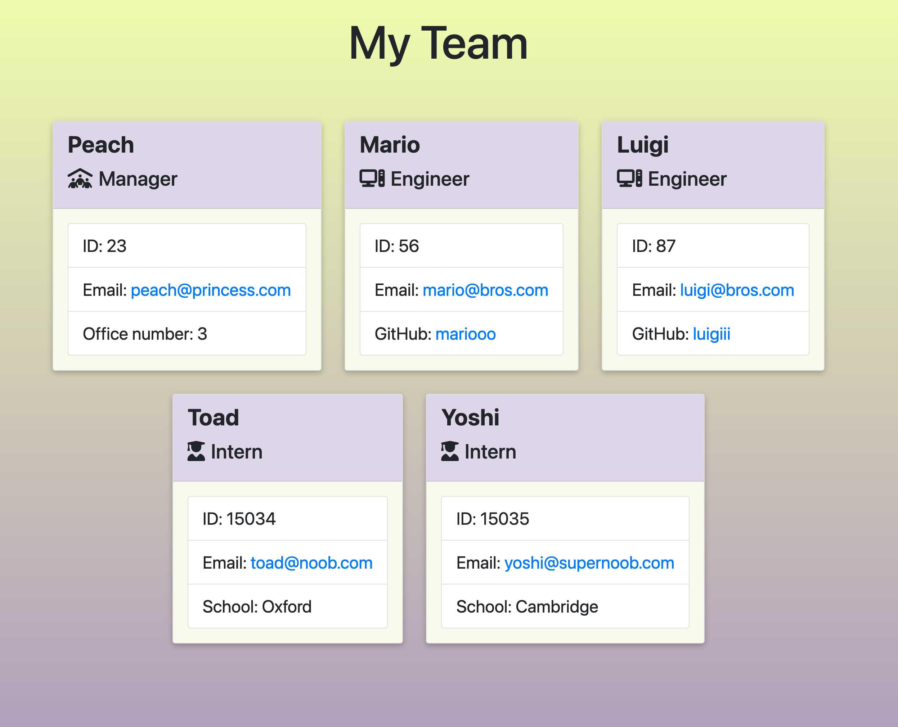
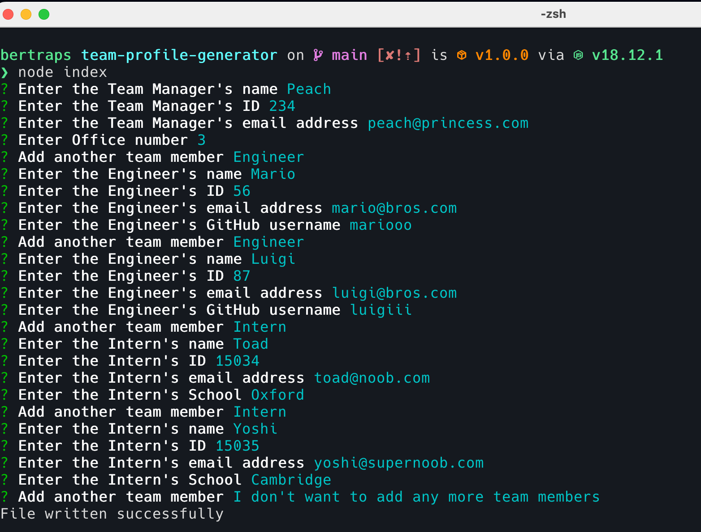

# Team Profile Generator


</br>

## 🎯 Description
This Team Profile Generator is a command-line application that will take in information about employees on a software engineering team through prompts, and will then generate an HTML webpage that displays summaries for each member of the team. The webpage offers the team's manager basic info on their team members and quick access to their emails and GitHub profiles.

</br>



</br>

### Table of Contents

- [🛠 Installation](#-installation)
- [💻 Usage](#-usage)
- [🔍 Tests](#-tests)
- [💬 Questions](#-questions)
- [🤝 Credits](#-credits)
- [💪 Contributing](#-contributing)
- [📖 License](#-license)


</br>

## 🛠 Installation

To use this application you will need to install dependencies by entering the following command on your terminal:

```
npm install
```

</br>

## 💻 Usage

The application is invoked by entering the following command on your terminal:

```
node index
```

</br>



</br>

## 🔍 Tests

To run tests enter this command on your terminal:

```
npm test
```

</br>

## 💬 Questions

Contact me if you have any questions!

- Drop me an email [bertaromanofernandez@gmail.com](mailto:bertaromanofernandez@gmail.com)
- Check out my GitHub profile [berta-rf](https://github.com/berta-rf)
- Frontend Mentor [@berta-rf](https://www.frontendmentor.io/profile/)
- LinkedIn [Berta Romano Fernandez](https://www.linkedin.com/in/berta-romano-fernandez-85a51117a/)

</br>

## 🤝 Credits

* [Inquirer package](https://www.npmjs.com/package/inquirer)
* [JEST](https://jestjs.io/docs/getting-started)
* [How to setup Jest for ES Module](https://how-to.dev/how-to-set-up-jest-for-es-module)
* [Email-Validator package](https://www.npmjs.com/package/email-validator)
* [Shields.io](https://shields.io/)
* [fs.writeFile() in Node.js](https://www.geeksforgeeks.org/node-js-fs-writefile-method/)

</br>

## 💪 Contributing

Contributions are what make the open source community such an amazing place to learn, inspire, and create. Any contributions you make are **greatly appreciated**.

If you have a suggestion that would make this better, please fork the repo and create a pull request. You can also simply open an issue with the tag "enhancement".

1. Fork the Project
2. Create your Feature Branch (`git checkout -b feature/AmazingFeature`)
3. Commit your Changes (`git commit -m 'Add some AmazingFeature'`)
4. Push to the Branch (`git push origin feature/AmazingFeature`)
5. Open a Pull Request

</br>

## 📖 License

This project is licensed under the terms of the **MIT License**. See [LICENSE](LICENSE) for more information.

 